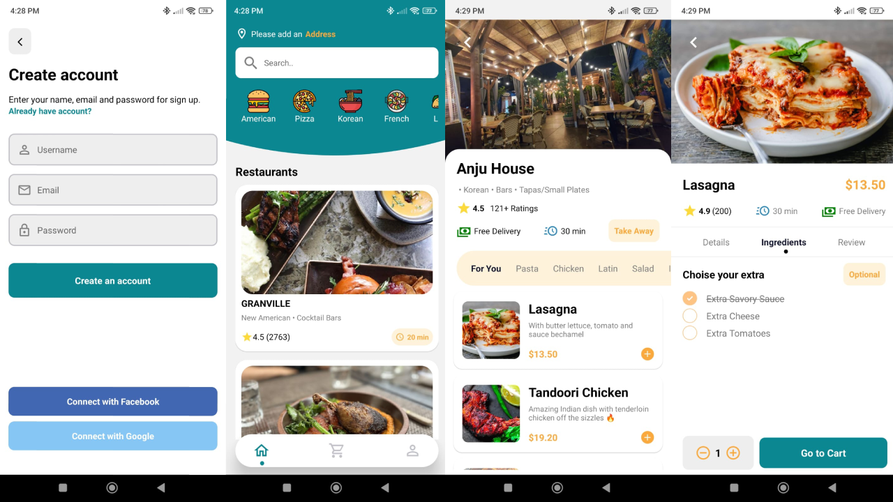
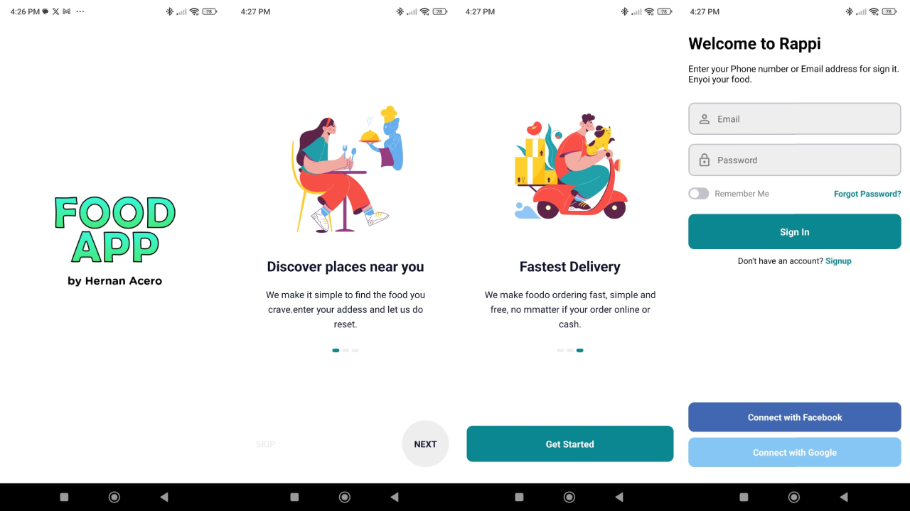
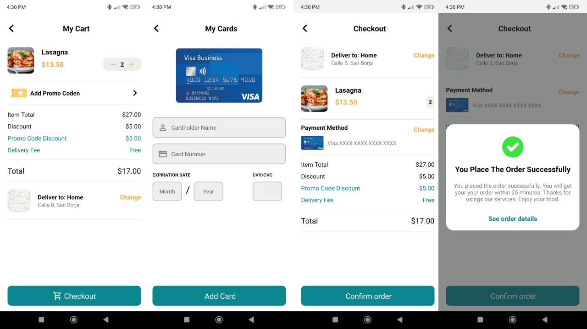
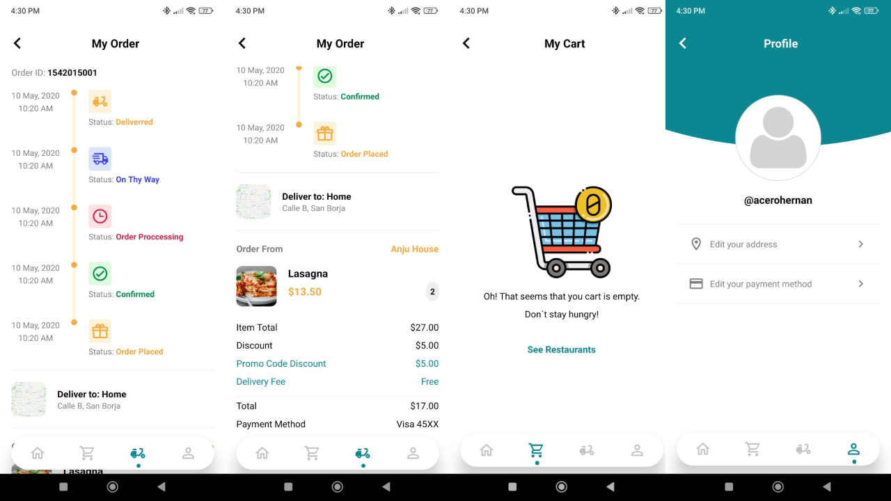

<!-- PROJECT LOGO -->

# Delivery App

 This is a delivery app made by React Native, Redux, Typescript, NodeJs, ExpressJs and MongoDB.

<!-- TABLE OF CONTENTS -->

  
Table of Contents

  <ol>
    <li>
      <a href="#about-the-project">About The Project</a>
      <ul>
        <li><a href="#built-with">Built With</a></li>
      </ul>
    </li>
    <li><a href="#screenshoots">Screenshoots</a></li>
    <li><a href="#license">License</a></li>
    <li><a href="#contact">Contact</a></li>
    <li></li>
  </ol>

## About

Delivery App is a delivery food ordering app for Andorid and IOS, built in React Native and Typescript. Built a food REST API with NodeJS, Express and MongoDB that is consumed by the page. The styles were added with CSS in Javascript using React Native's own library. To manage the state of the application, Redux and Redux Thunk were used for asynchronous calls to the API.

## Built With

* 
React Native

* 
Typescript

* 
Expo

* 
Redux

* 
NodeJS

* 
ExpressJS

* 
MongoDB

## Screenshoots

<!-- LICENSE -->
## License

Distributed under the MIT License. See `LICENSE.txt` for more information.

## Contact

Email: contact.acero.hernan@gmail.com
 
LinkedIn: <a href="https://www.linkedin.com/in/hernan-acero/">linkedin.com/in/hernan-acero</a>
